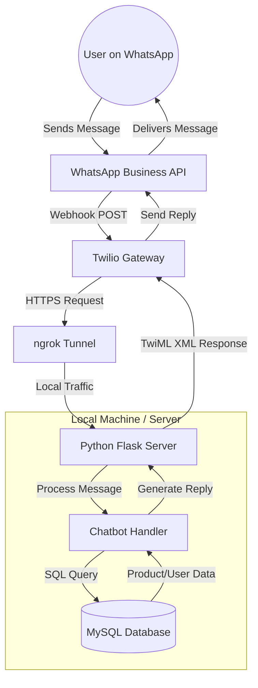
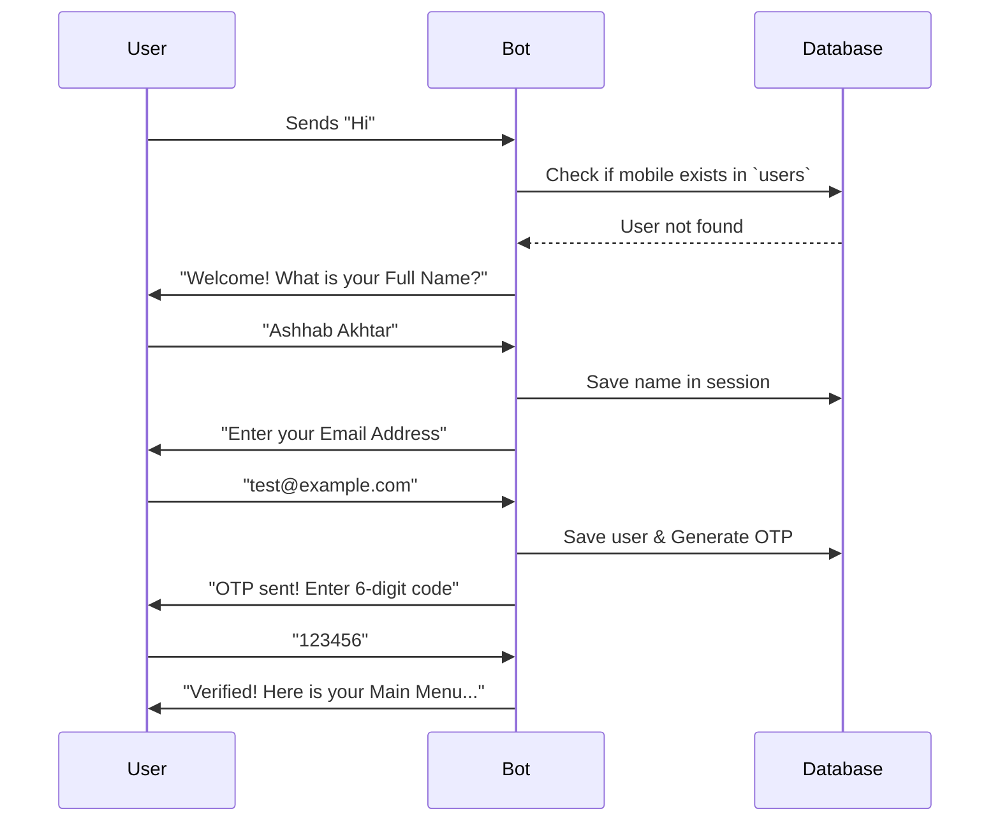
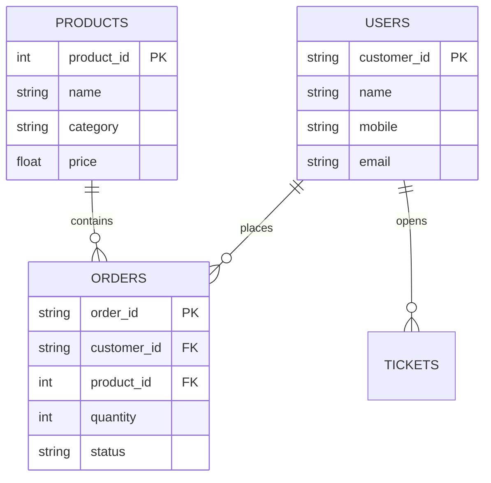

# 📊 CHUK Bot Visual Assets

Use these diagrams in your slides or documentation to explain how the system works.

## 1. System Architecture
This shows how the different parts of your project connect to each other.

---

## 2. The Registration Flow (Logic)
This explains the "Brain" of your chatbot and how it handles a new user.

---

## 3. Database Schema Relation
How your tables are connected inside MySQL.

